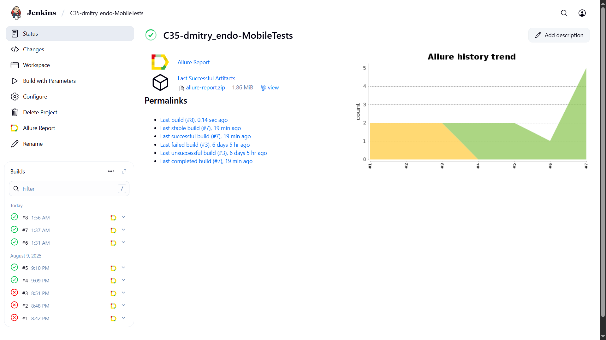
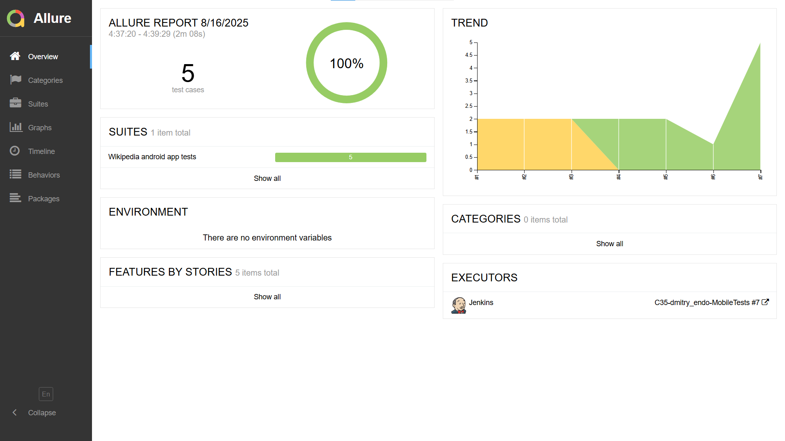
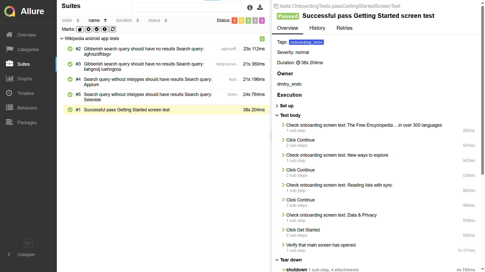
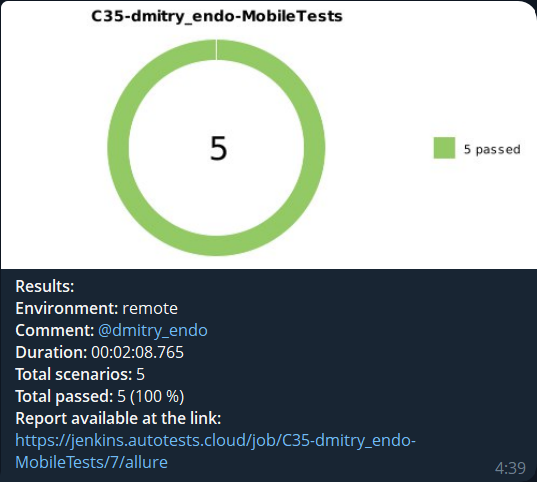
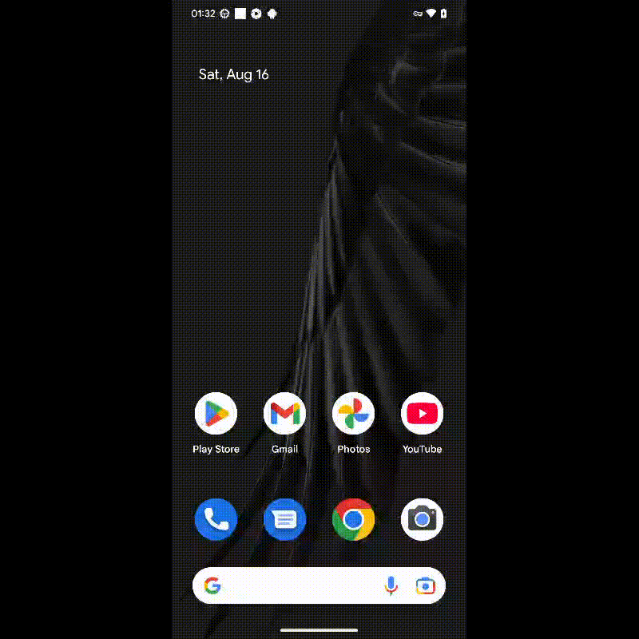

<p align="center">
  <a href="https://en.m.wikipedia.org/wiki/Main_Page" target="_blank">
    
  </a>
</p>


# Mobile automation testing project for the [Wikipedia app](https://en.m.wikipedia.org/wiki/Main_Page)


## **Contents:**
____

* <a href="#tools">Technologies and tools</a>

* <a href="#cases">Automated test-cases examples</a>

* <a href="#jenkins">Jenkins build</a>

* <a href="#console">Commands for running from the terminal</a>

* <a href="#allure">Allure report</a>

* <a href="#telegram">Telegram bot notification for Allure reports</a>

* <a href="#video">BrowserStack test run video example</a>


____
<a id="tools"></a>
## <a name="Technologies and tools">**Technologies and tools:**</a>


<p align="center">  
<a href="https://www.jetbrains.com/idea/"></a>  
<a href="https://www.java.com/"></a>  
<a href="https://github.com/"></a>  
<a href="https://junit.org/junit5/"></a>  
<a href="https://gradle.org/"></a>  
<a href="https://selenide.org/"></a>  
<a href="https://rest-assured.io/"></a> 
<a href="https://www.browserstack.com/"></a>
<a href="https://github.com/appium/appium"></a>
<a href="https://www.jenkins.io/"></a>  
<a href="ht[images](images)tps://github.com/allure-framework/allure2"></a>
</p>

- The automated tests are written in <code>IntelliJ IDEA</code> in <code>Java</code> using the <code>Selenide</code>, <code>REST Assured</code>, and <code>JUnit 5</code> frameworks.
- <code>Gradle</code> is used to build the project.
- <code>Android Studio VDM</code> & <code>Appium</code> are used to run tests locally.
- <code>BrowserStack</code> is used to run tests remotely.
- A job has been implemented in <code>Jenkins</code> for remote execution, with Allure report generation and automatic sending of results to <code>Telegram</code> (using a bot).


____
<a id="cases"></a>
## <a name="Automated test-cases examples">**Automated test-cases examples:**</a>
____
✓ *Checking onboarding (getting started) screen*  
✓ *Checking a successful search query*  
✓ *Checking an unsuccessful search query*


____
<a id="jenkins"></a>
## </a><a name="Сборка"></a> Jenkins [build](https://jenkins.autotests.cloud/job/C35-dmitry_endo-MobileTests/)</a>
____
<p align="center">  
  
</p>


<a id="console"></a>
## Commands for running from the terminal
___
***Local run (you must start Appium Server and turn on virtual Android device first):***
```bash  
appium server --base-path /wd/hub
```

```bash  
gradle clean test -Denv=local
```

***Remote run in BrowserStack:***
```bash  
gradle 
clean test 
-Denv=remote 
-Dusername=YOUR_USERNAME
-DaccessKey=YOUR_ACCESS_KEY
```
where <code>YOUR_USERNAME</code> & <code>YOUR_ACCESS_KEY</code> your BrowserStack credentials.
___


___
<a id="allure"></a>
## </a> <a name="Allure"></a> Allure [report](https://jenkins.autotests.cloud/job/C35-dmitry_endo-MobileTests/7/allure/)</a>
___

### *Overview page*

<p align="center">  
  
</p>  

**Test-cases** include:
- Steps
- Screenshot of the final step
- Page Source
- Device logs
- Test run video

<p align="center">  
  
</p>


____
<a id="telegram"></a>
## </a> Telegram bot notification for Allure reports
____
After the tests are completed: The Telegram bot sends a notification with the results and statistics.
<p align="center">  
  
</p>


____
<a id="video"></a>
## </a> BrowserStack test run video example
____

A video of each test case run is attached to the report.
<p align="center">
   
</p>


____
